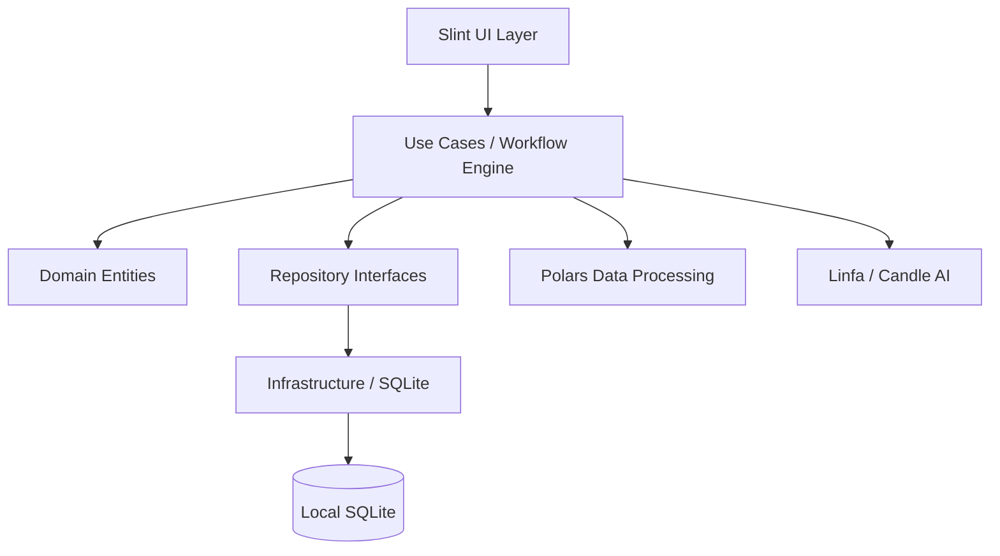

# Business Documentation: Ritel Workflow Automation

## 1. Project Analysis (Role-Based)

### BPA (Business Process Analyst)
- **Goal**: Enable non-technical users to automate complex data workflows.
- **Requirement**: Clear visual representation of logic. Audit trails of data movement.
- **Value**: Reduces time-to-insight by allowing rapid prototyping of data pipelines.

### PM (Project Manager)
- **Timeline**: 4 weeks to MVP.
- **Constraints**: Offline-first, high performance, cross-platform.
- **Focus**: Delivery of the core "Drag and Drop" and "Execution Engine" features.

### FE (Front End Engineer)
- **Tech**: Slint UI.
- **Challenge**: Custom canvas for node-based editor. Slint doesn't have a native graph component, so we will use absolute positioning and custom drawing for lines.
- **UX**: Smooth drag and drop, intuitive node properties panel.

### BE (Back End Engineer)
- **Tech**: Rust, Polars, SQLite.
- **Challenge**: Efficient data passing between nodes without memory overhead. Using Polars' LazyFrame for optimization.
- **Reliability**: Transactional safety in SQLite for workflow metadata.

### PQA (Project Quality Assurance)
- **Testing**: Unit tests for every node type. Integration tests for full pipeline execution.
- **UI Testing**: Verification of drag-and-drop coordinates and connection logic.

### User
- **Expectation**: "It just works." No cloud login required. Fast startup. Easy to share workflow files.

## 2. Feature List
1. **Visual Canvas**: Drag and drop nodes from a palette.
2. **Dynamic Connections**: Visual lines representing data flow.
3. **Data Source Nodes**: CSV, JSON, and SQLite input.
4. **Processing Nodes**: Filter, Select, Join, Group By.
5. **Output Nodes**: File output, Database write, Table view.
6. **Execution Logs**: Real-time feedback during workflow run.
7. **Local Persistence**: All workflows saved to a local SQLite database.

## 3. Architecture Analysis
- **Clean Architecture**:
    - **Domain**: Pure business entities (Node, Workflow, DataChunk).
    - **Use Cases**: Orchestrates data movement.
    - **Infrastructure**: Concrete implementations (Polars engine, SQLite storage).
    - **UI**: The Slint-based view.
- **Performance**: Rust's zero-cost abstractions and Polars' vectorized execution ensure speed even on low-end hardware (ARM/MIPS).

## 5. System Architecture Diagram

### Data Flow Overview
1. **User Action**: Drag node or click Run.
2. **UI Layer**: Captures events and triggers Use Cases.
3. **Engine**: Fetches metadata from Domain, processes data via Polars/AI.
4. **Persistence**: Saves state to SQLite or File System.

## 6. Machine Learning & AI Capabilities
- **Classical ML**: K-Means, Logistic Regression (Linfa).
* **Deep Learning**: ResNet, ImageNet inference support via Candle.
* **NLP**: Text analysis nodes for sentiment and classification.
* **Computer Vision**: Image analyze nodes for preprocessing and feature extraction.
